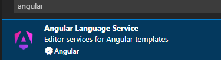
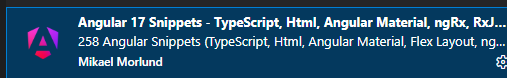
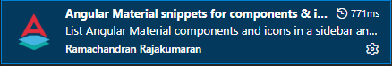
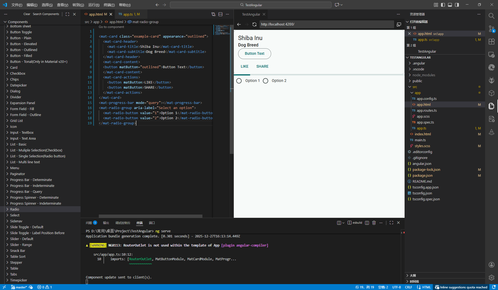

### AngularVSCode环境配置
#### 安装Angular
前往Angular官网https://angular.dev/，查看Angular更新内容  
1. 先安装nodejs
1. ```npm install -g @angular/cli```
1. ```ng new <project-name>``` 创建项目
#### Vscode配置环境
1. 安装官方拓展  
  
1. 安装代码片段(包含MaterialDesign) 可选
   
1. 安装语言增强拓展(包含自动导入组件)
  
1. 为AngularMaterial添加增强拓展(非常推荐)  
  
