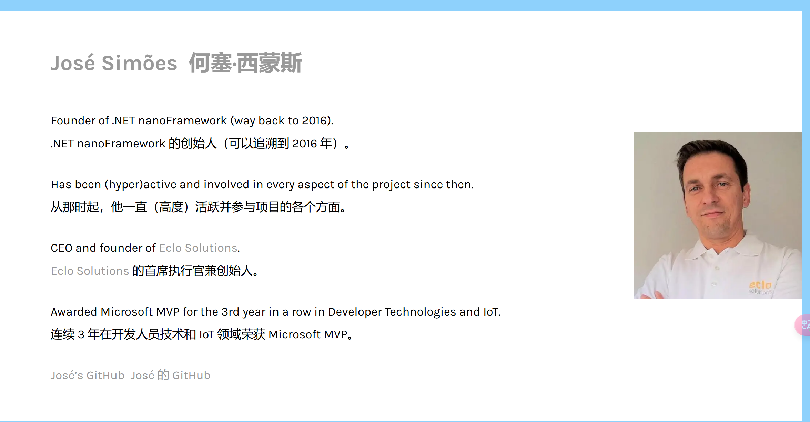

###                                                             nanoFramework学习

#### 介绍

​                大二上发现的一个嵌入式框架，我专业是自动化，课程中要学不少嵌入式的东西，比如51，Stm32，Stm32，学校教的都是C语言，但是用C写这种东西太痛苦了，平时用C#和VS多了，使用keil这种软件比吃屎还难受啊，而且封装程度太低，其实51还好，keil公司已经为我们封装好了不少东西，但是还是要记住不少寄存器，很难受，感觉就不是看编程的，而是看你的记忆力....Stm32的更没法说，要是使用hal库还好，封装的不错，要是使用标准库函数就痛苦了，超级超级恶心，配置一个引脚，居然是TM定义一个结构体，然后传值进去配置，无语了，明明枚举+方法，就可以超级优雅的配置引脚！！！还有就是PWM，SPI，I2C，定时器，中断等常用工具更是无敌，配置一个pwm几十行代码，让程序员手动算占空比就很恶心，明明都可以通过方法，使用构建器模式传一个配置进去，一行代码的事情，多了那么多代码，出点错，程序员就要一点一点Debug了，就会纠结是不是自己算错了啊，还是结构体配置错了等等，很耗时间的。

​              还有一个地方不得不吐槽的是编译器太jb难用了，要是盗版，很大概率连代码智能感应都没有，代码高亮也没有，简直就是纯文本编辑器，写完根本不知道有没有语法错误，然后提示也是纯白色纯英文，让开发者不得不花大量的时间在无意义的工作上。。。再看VS，简直是天神下凡，太好用了。起初我就想能不能用其他语言，于是发现了荷兰的一家公司开发了VB语言开发嵌入式的框架，但是太老了，35年前的东西，光是工具我就找了好久，下载后体验也是一言难尽....心如死灰之时，Ai告诉我了一个基于Dotnet的嵌入式开发框架，瞬间勾起了我的兴趣！

​             nanoFramework是微软废弃项目——.Net Micro Framework(微软不知道放弃了多少个项目)的后继，Jose Simoes是该项目的创始人，现在该项目由社区维护，开源—免费—强大，社区基于这个框架做了大量的固件适配，平时开发中需要功能，他都应有尽有，这里不再多少，您可前往官网查看! [.NET nanoFramework – 为嵌入式系统编写 C# 代码变得容易。 --- .NET nanoFramework – Making it easy to write C# code for embedded systems.](https://nanoframework.net/)

#### 支持平台

1. 51全系列不支持，原因是性能太差了
2. Stm32部分支持
3. Esp32基本都支持
4. 官网有着详细设备支持，可前往官网查看

#### 开发工具

Visual Studio :全宇宙最强C#编译器

Visual Studio Code ：超级强大的IDE

#### 我的选择

我有多台设备

1. Windows  X64
2. Windows On Arm 
3. Linux

最适合开发nanoFramework的工具是Visual Studio,但遗憾的是他目前仅支持Window x64
对于其他设备，可以使用Visual Studio Code，但功能有限，不支持断点跟踪调试
两个开发工具，我应该都会使用

然后是硬件，防止踩空，不建议使用由社区开发的固件，我准备使用Esp 32 Wood，内置蓝牙Wifi，性能强大
512kb内存，除掉nano CLR的占用，我们应该还有400Kb左右的内存可以使用，闪存是4MB，绝对够使用！价格也就20元。

#### 结语

接下来我会写出nanoFramework的学习教程，希望nanoFramework能给我带来一段不一样的开发体验！❤❤❤

