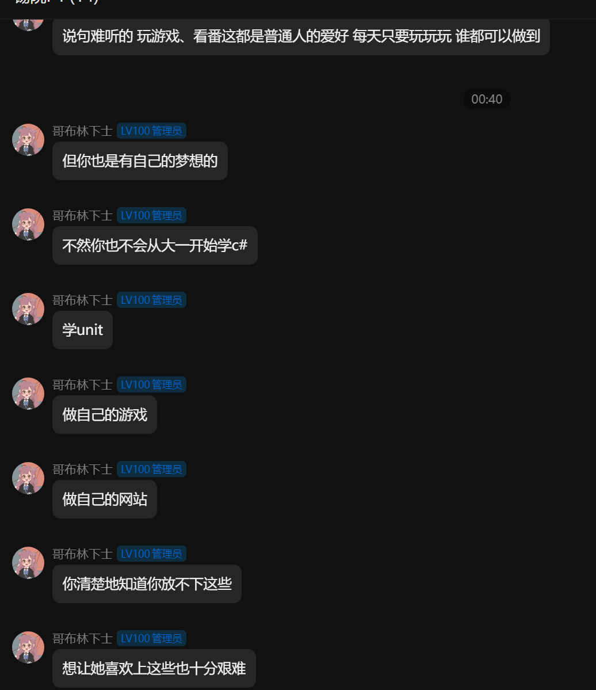

###                                                                                                            

###                                                        我到底怎么了

​            最近我忧虑了，虽然总是满嘴说着埃隆马斯克的名言——不要忧虑过去担心未来，把时间和精力还给自己，但是我内心真的很糟糕。人不可能突然心情不好，一切皆有因，那我到底是因为什么呢？

​            主要是因为两点，一是戒断反应，二是对自己的不自信，先说第一点吧，上周末我面基了一个网友，同学的朋友，我们上午一起去商场打舞萌（一个音游，玩法就是按照要求点东西），她真的超级厉害，那么快的速度，看的我都眼花缭乱，她都能从容应付，不低于99%的同步率，真是大神啊，至于我嘛，菜鸡一枚，简单的难度都不能应付，中午我们一起吃了火锅鸡，我靠，真是超级好吃，然后去了她学校附近转转。下午我们一起去淮安西游乐园游玩(这个乐园做的超级棒，平齐迪士尼乐园！)，我真的好开心好开心，我们游玩了各种项目，我体验了好多从来没有玩过的东西，我们从中午玩到晚上，具体我会单独写一篇介绍....我忘记了时间，忘记了代码，直到晚上和她分别，我的思绪也回到了现实，这一切就如过往云烟一样，转眼间消逝即散....平时的我满脑子都是代码，都是编程，偶尔玩玩游戏，她喜欢玩游戏，看番，各种东西，除了游戏外，我们好像是两个世界的人啊，没有共同话题，又怎能玩到一起，今后，游戏总有玩腻的时候，今后，我们还能一起玩吗？也许，这次便是我们最后一次见面。

    

   第二点便是编程上的，因为心情糟糕，编程又是一个极度需要理性的事情，导致我学各种东西都学不进去，写代码也都冷静不下来，好多东西都交给了AI，明明AI讲的那么好，我却还不明白，感觉自己好笨，仅有满腔热血，我忘记了学习编程的本心，我真的好失败，随着代码的增加，这样的情绪也越来越重，我开始焦虑开始担心未来，开始害怕....、

​             时间会冲淡一切，经过一周，我的心情好多了，好多事情我也想明白了，我知道，我应该继续前进了...

​                                                                                                                                                        写于2025年3月28日