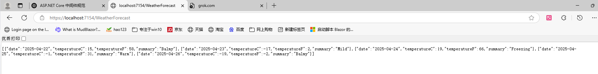

##                                     DI和中间件原理

### 简介

本篇文章将介绍Asp.Net Core Web Api是处理Http请求和生成Http响应，将会讲解部分底层工作原理，相信通过本篇文章，您一定会对Web Api的工作原理有着更深层次的理解。

### 模板代码

首先，新建一个Asp.Net Core Web Api项目（没有native AOT），勾选使用控制器，之后您将看到如下的内容

```csharp
var builder = WebApplication.CreateBuilder(args);

// Add services to the container.

builder.Services.AddControllers();
// Learn more about configuring OpenAPI at https://aka.ms/aspnet/openapi
builder.Services.AddOpenApi();

var app = builder.Build();

// Configure the HTTP request pipeline.
if (app.Environment.IsDevelopment())
{
    app.MapOpenApi();
}

app.UseHttpsRedirection();

app.UseAuthorization();

app.MapControllers();

app.Run();
```

我们删除OpenAPi和不影响工作的内容，还剩以下代码，下面是一个Asp.Net Core Web Api项目的最小配置

```csharp
var builder = WebApplication.CreateBuilder(args);

builder.Services.AddControllers();

var app = builder.Build();

app.MapControllers();

app.Run();
```

启动项目后，打开浏览器，访问托管主机地址+/WeatherForecast，您会发现可以正常获取到天气数据



### 代码讲解

#### WebApplicationBuilder

```csharp
var builder = WebApplication.CreateBuilder(args);
```

先创建一个Web主机构建器，用来启动项目
参数将从命令行页面传递过来的args参数传递了进去，然后里面会进行以下工作

1. ###  创建默认的 HostBuilder 和 WebHostBuilder

   > 🚩 **HostBuilder（泛用主机）** 是整个应用运行的根容器，ASP.NET Core 就是在它上面运行的。

   创建时，会自动添加：

   - 用于运行 ASP.NET Core 的 **Kestrel 服务器**
   - 支持 IIS 集成
   - 支持环境变量读取（比如 `ASPNETCORE_ENVIRONMENT`）

2. ###  自动加载配置文件（Configuration）

   默认自动加载以下配置源，合成 `builder.Configuration`：

   

   | 配置来源                       | 是否默认加载   | 优先级         |
   | ------------------------------ | -------------- | -------------- |
   | `appsettings.json`             | ✅ 是           | 中等           |
   | `appsettings.Development.json` | ✅ 是（看环境） | 高             |
   | 用户环境变量                   | ✅ 是           | 更高           |
   | 命令行参数 `args`              | ✅ 是           | 最高           |
   | `secrets.json`（开发）         | ✅ 是           | 更高（开发时） |

   举个例子：

   ```csharp
   bash
   
   dotnet run --MySetting=123
   ```

   你在 `Program.cs` 里写：

   ```csharp
   var myValue = builder.Configuration["MySetting"];
   Console.WriteLine(myValue); // 输出 123
   ```

3. ### 创建 DI 容器（IServiceCollection）

   就是这句：

   ```csharp
   builder.Services
   ```

   是用来注册各种服务的地方，比如：

   ```csharp
   builder.Services.AddControllers();
   builder.Services.AddSingleton<MyService>();
   ```

   这一步创建的是微软内置的 DI 容器，但你也可以替换成 Autofac 等其他容器。

4. ###  自动注册默认服务（默认依赖）

   框架已经帮你注册了一大堆服务，不需要你写，比如：

   - 路由系统
   - 日志系统（ILogger）
   - 配置系统（IConfiguration）
   - 主机生命周期控制（IHostApplicationLifetime）
   - 系统时间提供（ISystemClock）

    你在控制器里用 `[FromServices]`、构造函数注入，都是基于这。

5. ###  初始化默认日志系统（Logging）

   `builder.Logging` 里面自动配置了：

   - 控制台日志输出
   - Debug 输出
   - 日志级别过滤（比如只输出 Error）

   你可以通过配置文件设置日志等级：

   ```json
   json复制编辑"Logging": {
     "LogLevel": {
       "Default": "Information",
       "Microsoft": "Warning"
     }
   }
   ```

6. ### 创建 WebApplicationBuilder 返回 builder 对象

   最后把一切组合，封装成一个强大的 `WebApplicationBuilder` 对象，包含：

   - `Configuration`（配置）
   - `Services`（依赖注入）
   - `Logging`（日志系统）
   - `Environment`（开发/生产判断）
   - `Host`（宿主设置）

#### AddControllers