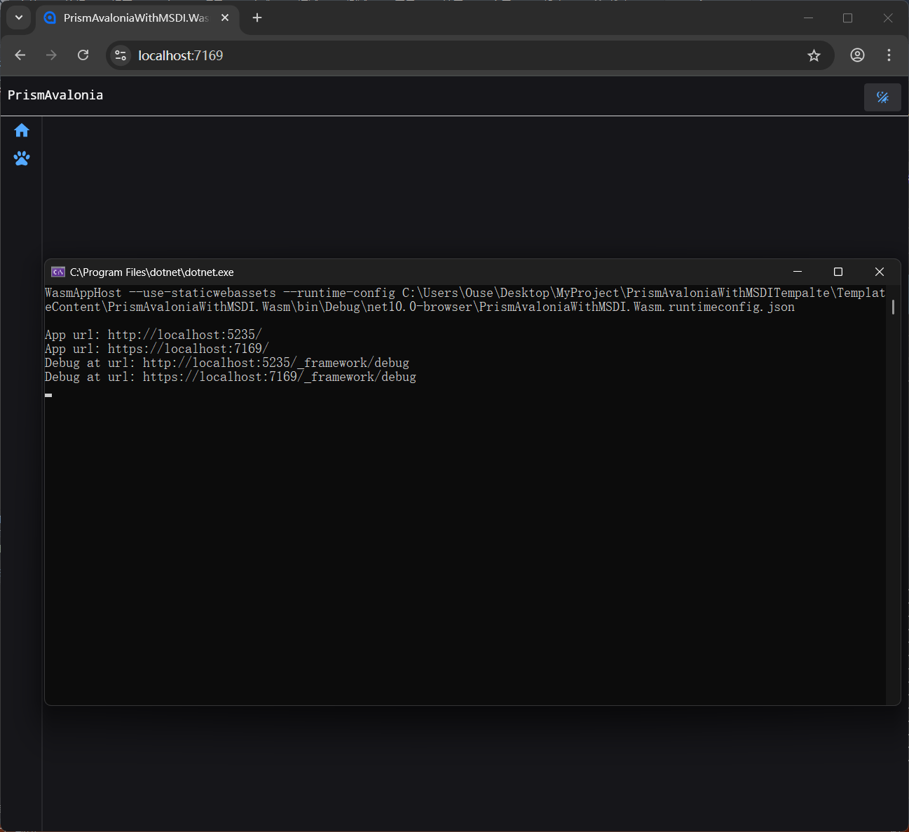

### AvaloniaWasm发布到GithubPages

#### 准备

首先您要确保Debug模式能够正常运行AvaloniaWASM
如下：


#### 开始

1. 先关闭发布裁剪，配置参考如下

   ```xml
   <Project Sdk="Microsoft.NET.Sdk.WebAssembly">
   	<PropertyGroup>
   		<TargetFramework>net10.0-browser</TargetFramework>
   		<OutputType>Exe</OutputType>
   		<Nullable>enable</Nullable>
   		<WasmBuildNative>true</WasmBuildNative>
   		<ManagePackageVersionsCentrally>false</ManagePackageVersionsCentrally>

   		<!--这里禁用裁剪，因为裁剪容易造成问题，您可以自己设置裁剪规则-->
   		<PublishTrimmed>false</PublishTrimmed>
   	</PropertyGroup>

   	<ItemGroup>
   		<PackageReference Include="Avalonia.Browser" Version="11.3.10" />
   		<ProjectReference Include="..\PrismAvaloniaWithMSDI\PrismAvaloniaWithMSDI.csproj" />
   	</ItemGroup>
   </Project>
   ```
2. 本地发布测试 dotnet publish
   然后可以使用python -m http.server开启一个web服务器托管静态资源浏览器访问试试
   确保没问题后，即可配置github action
3. 打开github仓库位置，添加一个action，示例如下
   **注意job-4中，要修改为您仓库的路径!**

   ```yaml
   name: Deploy Avalonia WASM to GitHub Pages
   # 触发条件：当 master 分支有代码推送（push）时执行
   on:
     push:
       branches: [ master ]

   # 设置权限：允许 Action 向仓库写入内容（部署到 gh-pages 分支需要此权限）
   permissions:
     contents: write

   jobs:
     build-and-deploy:
       runs-on: ubuntu-latest

       steps:
         # 1. 下载源代码
         - name: Checkout Source Code
           uses: actions/checkout@v4

         # 2. 安装 .NET SDK (指定为 10.0 版本)
         - name: Setup .NET 10
           uses: actions/setup-dotnet@v4
           with:
             dotnet-version: '10.0.x'

         # 3. 安装 WASM 本地工具链 
         - name: Install WASM Tools
           run: dotnet workload install wasm-tools

         # 4. 发布项目
         # -c Release: 使用发布模式
         # -o release: 将结果输出到名为 release 的文件夹
         # 注意：请确保下方的路径指向你实际的 .Wasm.csproj 文件
         #注意路径开头不能写/
         - name: Dotnet Publish
           run: dotnet publish your/project.wasm -c Release -o release

         # 5. 修正 GitHub Pages 路径
         # GitHub Pages 默认路径是 /仓库名/，而生成的 index.html 默认是 /
         # 如果不修改，会导致所有 JS/WASM 文件 404 无法加载
         - name: Fix Base Href for GitHub Pages
           run: |
             # 获取仓库名称 
             REPOSITORY_NAME=$(echo $GITHUB_REPOSITORY | sed 's:.*/::')
             # 将 index.html 中的 <base href="/" /> 替换为 <base href="/仓库名/" />
             sed -i "s|<base href=\"/\" />|<base href=\"/$REPOSITORY_NAME/\" />|g" release/wwwroot/index.html
             # 创建 .nojekyll 文件，防止 GitHub 过滤掉以点号开头的文件夹（如 .managed）
             touch release/wwwroot/.nojekyll
         # 6. 部署到 gh-pages 分支
         - name: Deploy to GitHub Pages
           uses: JamesIves/github-pages-deploy-action@v4
           with:
             folder: release/wwwroot # 告诉插件从哪个文件夹寻找要发布的文件
             branch: gh-pages        # 目标分支（如果不存在会自动创建）
             clean: true             # 每次部署前清理旧文件
   ```
4. 检查action情况，确认无误
5. 打开仓库设置，开启GithubPages
6. 尝试访问GitHubPages，打开控制台查看加载情况！

#### 结语

WASM进行裁剪，发布bug过多，暂时不推荐裁剪...
