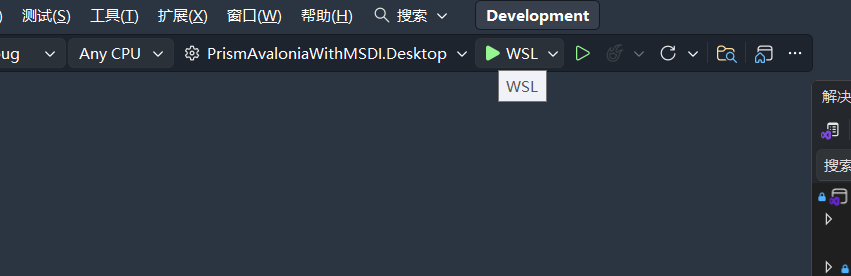
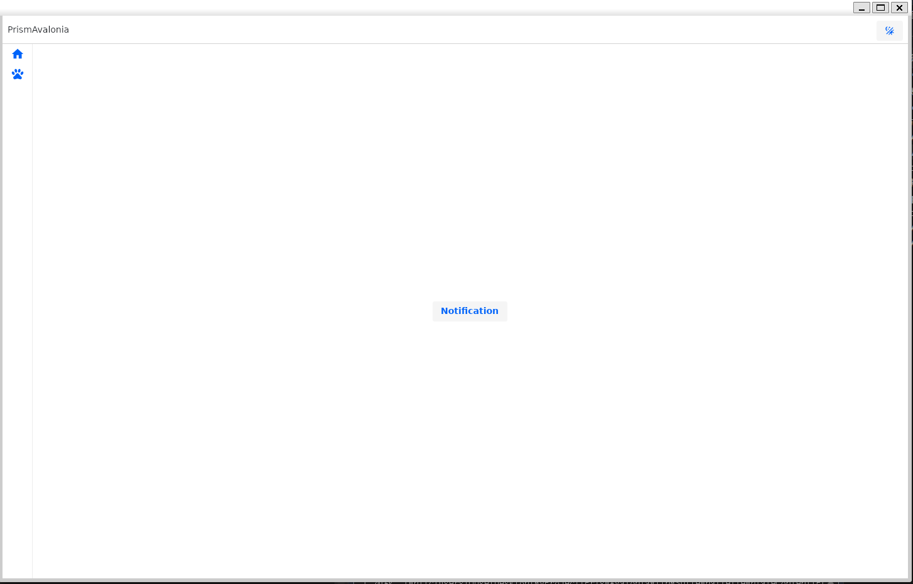
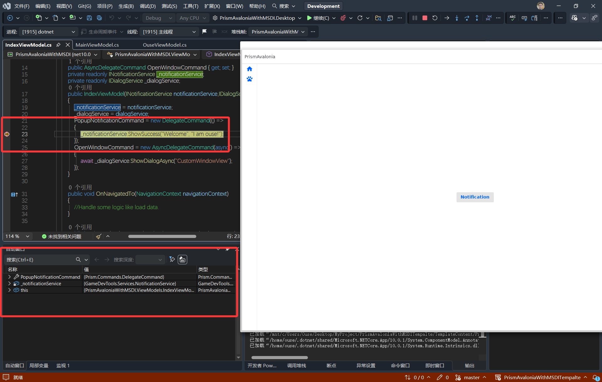

### VS中使用WSL调试AvaloniaInLinux

#### 介绍

Avalonia是一个跨平台的UI框架，有时候我们需要在Windows上测试linux，这时，WSL2就派上了用场，我们无需装Linux，可以直接在VS中调试！断点等功能均可使用😋。

#### 开始

1. 首先您需要在您的电脑安装wsl2+任何linux发行版。
2. 然后安装dotnet sdk (请确保dotnet是从/usr/local/bin或者是/usr/bin加载，而非其他路径，负责VS找不到dotnet指令!!!)
   教程可以博客界面搜索Linux安装DotnetSdk教程
3. 安装x11

   ```bash
   sudo apt install -y xauth x11-apps
   ```
   如果找不到x11，请升级包源

   ```bash
   sudo apt update
   ```
4. 切换到WSL，运行！
   

   
5. 断点调试等均可正常工作(诊断无法工作)
   
