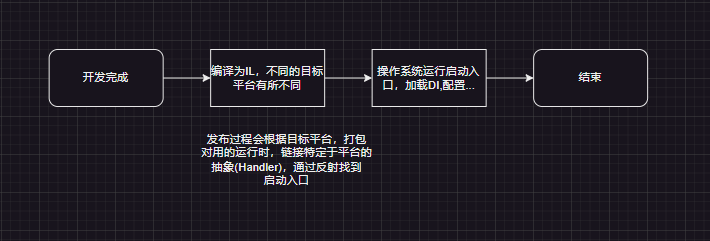

##                                                                                Maui工作方式

### 介绍

  Maui是Dotnet开发平台下一个用于开发跨平台原生应用的框架，使用XMAL和C#语言开发。支持多个平台(官方不支持Linux)。本文旨在通过图文描述，讲懂Maui的工作方式。
  Maui的运行时根据目标平台不同，有所区别，桌面端使用.Net Core(.Net5之后)，移动端使用Mono(.Net早期的跨平台运行时)

### 启动过程

IL：中间代码，类似Java的字节码
反射：能够获取程序集的所有元数据

### 工作方式

Maui不像某些框架使用自己的渲染引擎，使用的是操作系统提供的组件(补:BlazorHybrid使用的也是操作系统提供的WebView组件)，我们作为开发人员，只需要关注业务逻辑，Handler对用的组件，微软已经帮我们实现好了。

### 结语

上述是微软官方文档，Ai，我的共同理解，如果存在问题，请指出！