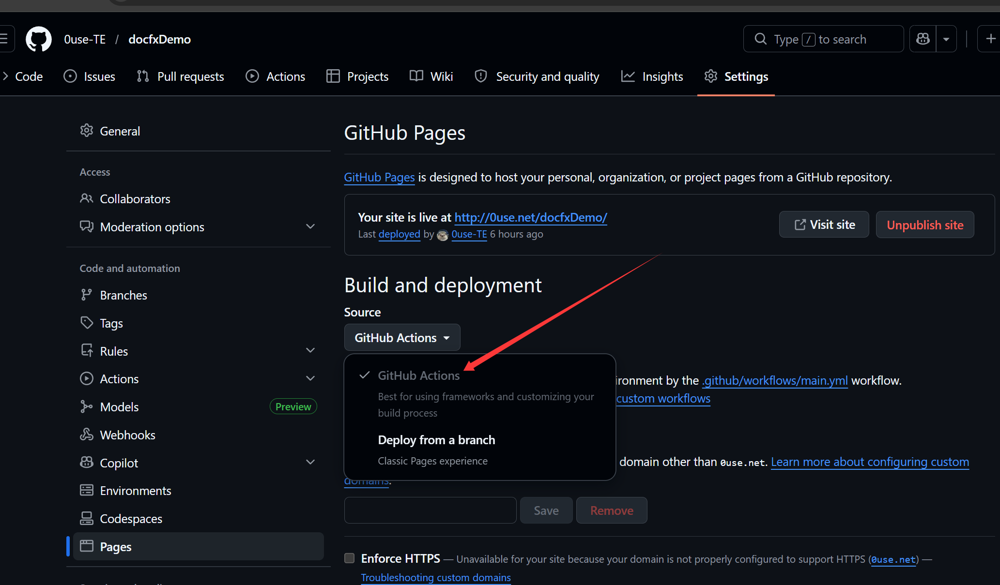

### Docfx生成文档

1. 安装docfx

   ```bash
   dotnet tool update -g docfx
   ```
2. 初始化

   ```bash
   docfx init
   ```
3. 每次修改均要构建

   ```bash
   docfx docfx.json
   ```
   以下开一个Web服务器

   ```bash
   docfx docfx.json --serve
   ```
4. 发布到Github Pages

   1. 先开启Github Page Action
      
   2. 写Github Action，更换下面的路径
      ```yaml
      # Your GitHub workflow file under .github/workflows/
      # Trigger the action on push to main
      on:
        push:
          branches:
            - main

      # Sets permissions of the GITHUB_TOKEN to allow deployment to GitHub Pages
      permissions:
        actions: read
        pages: write
        id-token: write

      # Allow only one concurrent deployment, skipping runs queued between the run in-progress and latest queued.
      # However, do NOT cancel in-progress runs as we want to allow these production deployments to complete.
      concurrency:
        group: "pages"
        cancel-in-progress: false

      jobs:
        publish-docs:
          environment:
            name: github-pages
            url: ${{ steps.deployment.outputs.page_url }}
          runs-on: ubuntu-latest
          steps:
          - name: Checkout
            uses: actions/checkout@v3
          - name: Dotnet Setup
            uses: actions/setup-dotnet@v3
            with:
              dotnet-version: 8.x

          - run: dotnet tool update -g docfx
          - run: docfx <docfx-project-path>/docfx.json

          - name: Upload artifact
            uses: actions/upload-pages-artifact@v3
            with:
              # Upload entire repository
              path: '<docfx-project-path>/_site'
          - name: Deploy to GitHub Pages
            id: deployment
            uses: actions/deploy-pages@v4

      ```
   3. 访问测试即可
