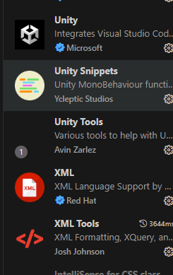
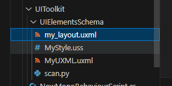

##           UIToolkit开发环境配置

### 前言

传统的UGUI学习成本太高了，各种组件，各种数学公式，对独立开发者真的不太友善，而且是拓展式的，要熟悉好久才能写出好看的效果来。UIToolkit是unity官方推荐的最新UI解决方案，我原本很高兴的玩了起来，其实最开始还好，学UIBuilder，拖拽式的嘛，知道写代码才痛苦，VS对USS和UXML的支持几乎为0，没有代码高亮，没有代码补全，就是纯文本编辑器，这对于我这种追求开发体验的人来说肯定是不行的，然后我尝试了Rider，UXML的标签是有感应的，但是里面style和class特性没有代码补全，也就意味着你要记住你写的所有的uss类名，这太影响效率了，并且我还是要准备使用zoolui的，这是一个基于tailwind的Uss框架，所以我必须得有Intellsence(智能感应)，于是找到了以下的解决方案。

### 教程

下载VsCode后，安装以下的第一，四，五插件



在.vscode/settings.json文件的最下面添加以下代码

```json
    "files.associations": {
      "*.uss":"css",
      "*uxml":"xml"
  },
  "xml.fileAssociations": [
      {
          "systemId": "UIElementsSchema/UnityEngine.UIElements.xsd",
          "pattern": "**/*.uxml"
      }
  ], 
  "editor.quickSuggestions": {
      "strings": true    
  },

```

uxml使用以下代码

```xml
<?xml version="1.0" encoding="utf-8"?>
<UXML xmlns="UnityEngine.UIElements">
  <VisualElement >
    <Button text="Click Me" class="ouse" />
  </VisualElement>
</UXML>
```

此时您会发现对于UXML标签已经有了智能感应，

然后接下来是脚本化生成json文件以供VsCode的代码片段使用，我们实现的是扫描一个文件夹下面的所有uss文件并输出到一个文件里面
文件组织结构如下


python代码，执行后，会将您输入的文件夹下面所有的uss类名放在一个json文件里面

```python
import re
import json
from pathlib import Path

def extract_classes_from_uss(file_path):
    with open(file_path, 'r', encoding='utf-8') as f:
        content = f.read()
    classes = re.findall(r'\.([\w-]+)(?::\w+)?\s*{', content)
    return classes

def generate_snippet_json(folder_path, output_file='xml.json'):
    folder = Path(folder_path)
    all_classes = set()
    
    for uss_file in folder.glob('*.uss'):
        print(f"Processing {uss_file}")
        classes = extract_classes_from_uss(uss_file)
        all_classes.update(classes)
    
    if not all_classes:
        print("No classes found in .uss files")
        return
    
    # Snippet 格式
    snippets = {
        cls: {
            "prefix": cls,
            "body": cls,
            "description": f"Class: {cls}",
        } for cls in sorted(all_classes)
    }
    
    output_path = folder / output_file
    output_path.parent.mkdir(exist_ok=True)
    with open(output_path, 'w', encoding='utf-8') as f:
        json.dump(snippets, f, indent=2)
    print(f"Snippets written to {output_file}")

if __name__ == "__main__":
    generate_snippet_json(".")
```

然后将ctrl+shift+p，输入配置代码片段，选择xml
将生成的内容拷贝进去


即可实现uss类的智能感应了😋😋😋
安装zoboUI,网址 [Installation - ZoboUI Docs](https://www.zoboui.com/docs/getting-started/installation)

### 结尾

弄了好久，终于可以愉快的写ui toolkit了