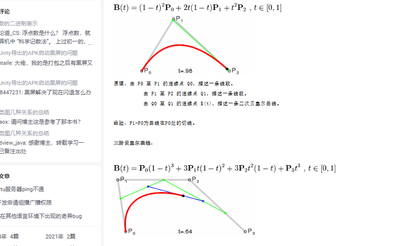
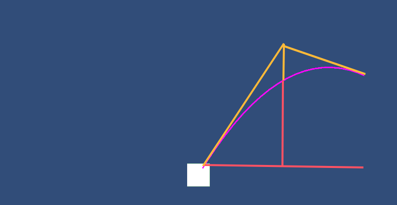

## 曲线旋转(贝塞尔曲线)

###### 数学原理


###### 图像



###### Unity中使用和代码

```c#
public class TestScript : MonoBehaviour
{

    public float value;
    public int pointCount;
    private LineRenderer lineRenderer;
    private void Awake()=>lineRenderer = GetComponent<LineRenderer>();
    

    void Update()
    {
        if(Input.GetMouseButton(0))
        {
            Vector3 mousePos=Camera.main.ScreenToWorldPoint(Input.mousePosition);
            DrawArrow(transform.position, mousePos);
        }

    }
    public void DrawArrow(Vector3 start, Vector3 end)//绘制曲线
    {
        Vector3 controlPoint = (start + end) / 2 + new Vector3(0, value, 0); 
        Vector3[] points = new Vector3[pointCount];

        for (int i = 0; i < points.Length; i++)
        {
            float t = i / (float)(points.Length - 1);//t的取值为0到1,通过多次取点，即可绘制出平滑曲线
            points[i] = Mathf.Pow(1 - t, 2) * start + 2 * (1 - t) * t * controlPoint + Mathf.Pow(t, 2) * end;//贝塞尔公式
        }
        lineRenderer.positionCount = points.Length;
        lineRenderer.SetPositions(points);
    }

}
```

###### Unity中显示

紫色为绘制点，最上面的交点即为控制点，通过调节控制点的上下实现曲线像哪侧弯曲




