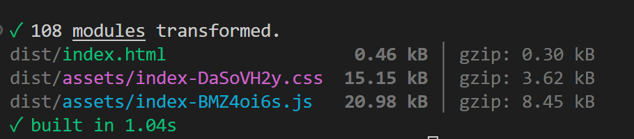

# SvelteWithDaisyUI

### 前言

物联网中跑Web，BlazorServer只适合完整的linux系统，blazor wam打包体积也过大，为了实现在裸机上跑web就不得不选择其它技术栈，原本考虑的是Angular，但是打包也有400kb，经过选择我看中了Svelte+DaisyUI.

### 创建

1. 创建Svelte模板

   ```bash
   npm create vite@latest my-svelte-app -- --template svelte-ts
   ```
2. 安装Tailwind

   ```bash
   npm install tailwindcss @tailwindcss/vite
   ```
3. 配置Vite插件

   ```typescript
   import { defineConfig } from 'vite'
   import tailwindcss from '@tailwindcss/vite'

   export default defineConfig({
     plugins: [
       tailwindcss(),
     ],
   })
   ```
4. 在CSS 文件中添加一个导入 Tailwind CSS 的 `@import`

   ```
   @import "tailwindcss";
   ```
5. 安装daisyui

   ```
   npm i -D daisyui@latest
   ```

   app.css文件添加

   ```@plugin
   @plugin "daisyui";
   ```

### 结语

实测空项目打包体积


