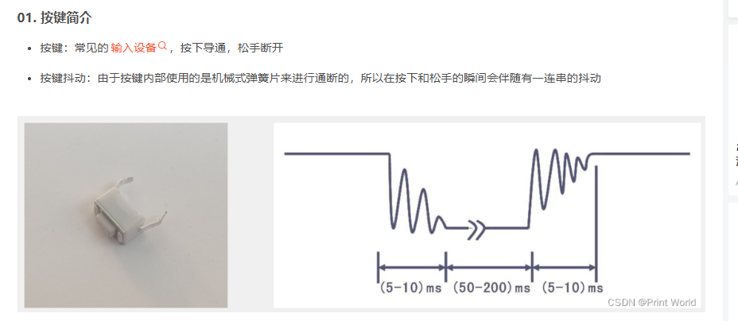
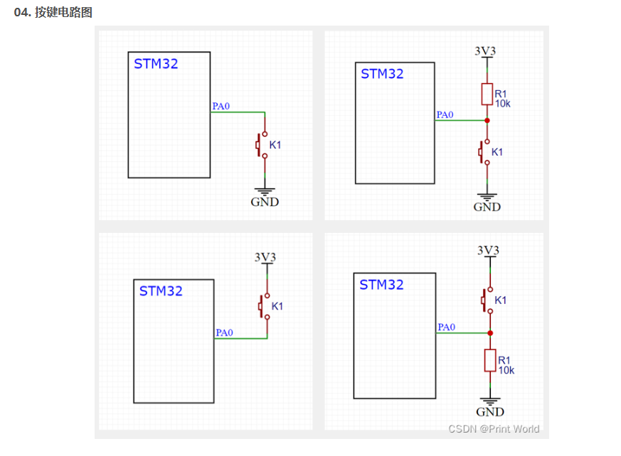
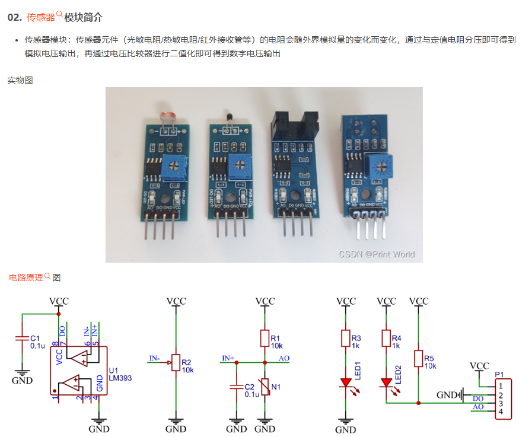
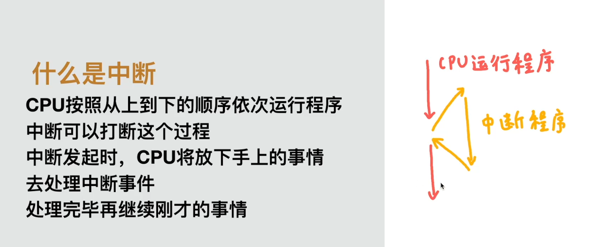
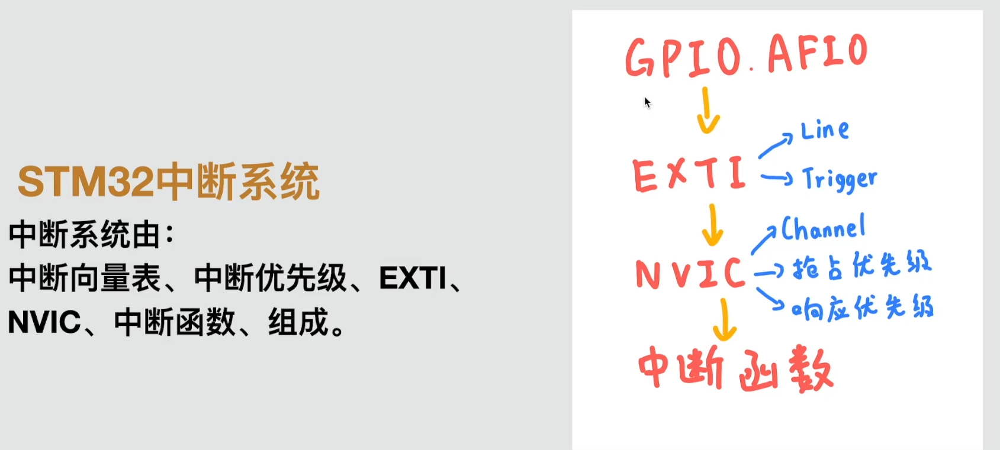
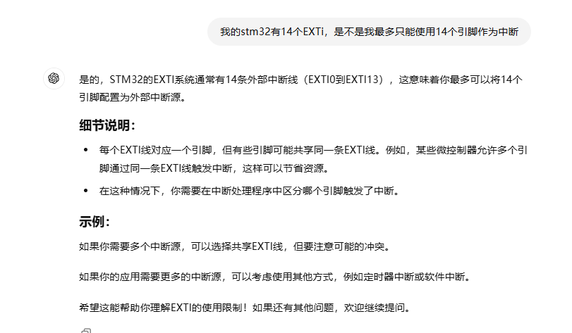
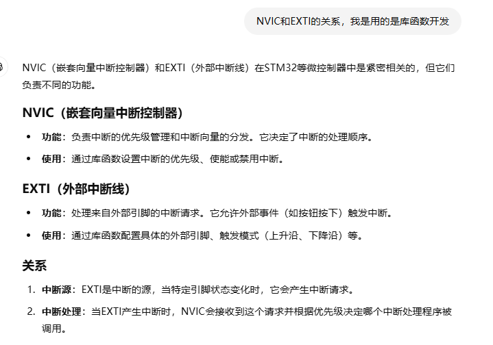
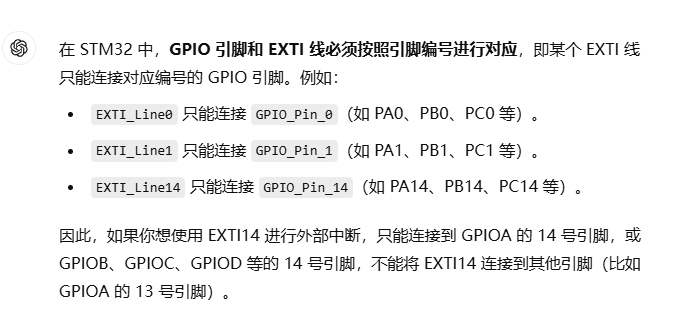
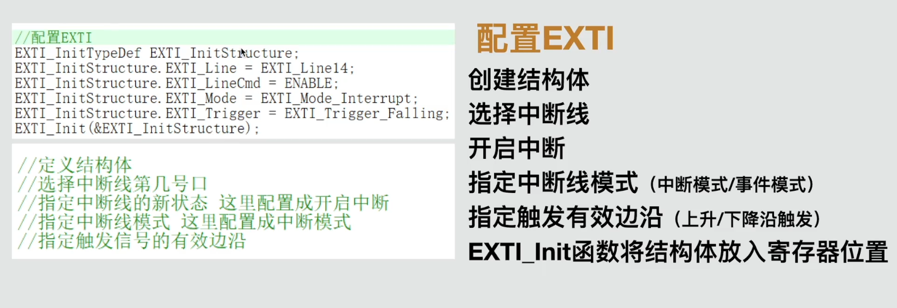
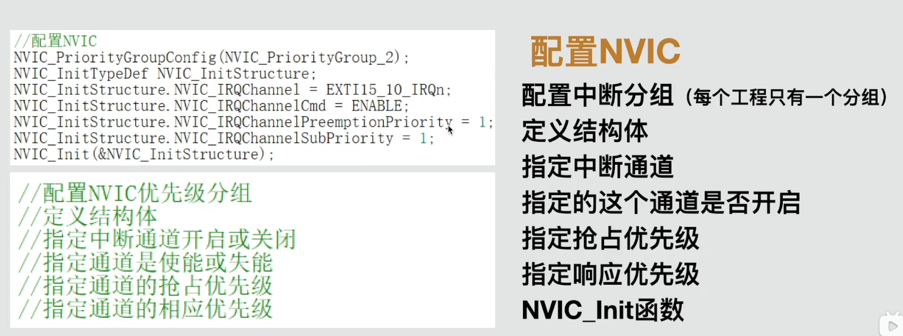

#                                       Stm32学习笔记

### 绪论


###### **MCU**

微控制器单元（MicroController Unit）：是把中央处理器、存储器、定时/计数器（timer/counter）、各种输入输出接口等都集成在一块集成电路芯片上的微型计算机。

###### 命名规则


###### MCU参数


###### 最小系统资源


晶振介绍：全称为晶体振荡器，是一种利用石英晶体的压电效应制成的电子元件，主要用于提供稳定的时钟信号。晶振利用石英晶体的机械共振来产生具有非常精确频率的电信号，具有高稳定性、品质因数、小尺寸和低成本等优点。‌
RTC晶振：实时时钟的缩写是RTC(Real_Time Clock)。RTC 是集成电路，通常称为[时钟芯片](https://baike.baidu.com/item/时钟芯片/8832713?fromModule=lemma_inlink)。实时时钟芯片是日常生活中应用最为广泛的消费类电子产品之一。它为人们提供精确的实时时间,或者为电子系统提供精确的时间基准,实时时钟芯片大多采用精度较高的晶体振荡器作为时钟源。有些时钟芯片为了在主电源掉电时，还可以工作，需要外加电池供电。
mircoUSB:用于与其他设备传输数据
PC13指示灯：PC13指示灯在STM32F103等微控制器中主要用于LED控制、状态指示和调试辅助等方面。通过编程控制PC13引脚的电平状态，可以灵活地实现各种指示灯效果和功能。

SWD调试接口：

SWD接口是一种串行调试接口，它定义了主机计算机与目标设备之间通过SWD线进行通信的格式和规范。

1. **引脚数量少**：相比传统的JTAG接口，SWD接口只需要两根信号线（SWDIO和SWCLK），有时还需要一个复位线（RST），从而大大减少了引脚的使用，有利于节约电路板空间和成本。
2. **高效可靠**：SWD接口在高速大数据传输情况下，整体性能比JTAG更好，因为它使用了更高效的数据包格式和错误检测机制。此外，SWD模式在高速模式下面更加可靠，减少了调试过程中发生错误的几率。
3. **直接访问**：SWD接口可以直接访问串行线调试端口（SW-DP），进而访问一个或多个接入端口（AP），通过AP可以访问系统的内存和寄存器，提供了更深入的调试能力。

###### STM硬件资源


###### 引脚定义


###### STM启动配置


区别：**STM32的存储区区别**

STM32微控制器的存储区主要可以分为Flash（ROM）和SRAM（RAM）两大类，进一步细分为多个不同的区域，用于存储不同类型的数据和代码。以下是这些存储区的主要区别：

1. Flash（ROM）
   - **Code区**：存放函数的二进制代码，即程序的主要执行部分。
   - **Ro-data区**：存放常量数据，如常量字符串，这些数据是只读的，位于Flash中。
   - **中断向量表**：位于Flash的固定地址，用于存储中断服务例程的入口地址。
2. SRAM（RAM）
   - **Stack（栈）**：由编译器自动分配和释放，用于存放函数的参数值、局部变量的值等。栈是向下生长的，即内存地址从高至低。
   - **Heap（堆）**：一般由程序员分配和释放，用于动态内存分配。堆是向上生长的，即内存地址从低至高。
   - **.data段**：存放已初始化的全局变量和静态变量，这些变量在程序启动时从Flash复制到SRAM。
   - **.bss段**：存放未初始化的全局变量和静态变量，这些变量在程序启动时会被初始化为零。

这些存储区的主要区别在于它们的用途、生命周期和访问方式。Flash用于存储程序代码和常量数据，具有非易失性，即断电后数据不会丢失。而SRAM用于存储程序运行时需要的临时数据和变量，具有易失性，即断电后数据会丢失。

**STM32的Boot三种模式**

STM32的Boot模式决定了芯片复位后从哪个存储区域启动程序。用户可以通过设置BOOT0和BOOT1引脚的状态来选择启动模式。以下是三种Boot模式的详细说明：

1. 从主闪存存储器启动（BOOT0=0, BOOT1=0）
   - 这是最常用的启动模式，STM32从内置的Flash启动程序。一般我们使用JTAG或SWD模式下载程序时，就是下载到这个Flash中，重启后也直接从这启动程序。
2. 从系统存储器启动（BOOT0=1, BOOT1=0）
   - 在这种模式下，STM32从系统存储器（一块内部的ROM区域）启动。这个区域出厂时预置了一段BootLoader程序，用于ISP（在线系统编程）下载。用户可以通过串口将程序下载到Flash中，但需要先通过BootLoader程序进行引导。
3. 从内置SRAM启动（BOOT0=1, BOOT1=1）
   - 这种模式一般用于程序调试。SRAM是易失性存储器，没有程序存储能力，但访问速度较快。在调试阶段，如果只需要修改代码的一小部分并快速验证，可以从SRAM启动以节省Flash的擦写次数。然而，由于SRAM的易失性，一旦断电，程序就会丢失。
     每种Boot模式都有其特定的应用场景和限制。在选择启动模式时，需要根据实际需求进行配置。

### GPIO介绍

###### 简介


###### 模式


### 基础硬件

###### LED和蜂鸣器简介


###### 面包板简介


### GPIOApi介绍

###### GPIO_Exported_Types

```c
/** @defgroup GPIO_Exported_Types
  * @{
  */
//宏定义函数 用于判断传入的PERIRH是否是GPIO端口
#define IS_GPIO_ALL_PERIPH(PERIPH) (((PERIPH) == GPIOA) || \
                                    ((PERIPH) == GPIOB) || \
                                    ((PERIPH) == GPIOC) || \
                                    ((PERIPH) == GPIOD) || \
                                    ((PERIPH) == GPIOE) || \
                                    ((PERIPH) == GPIOF) || \
                                    ((PERIPH) == GPIOG))
```

######  GPIOSpeed_TypeDef

```c
/** 
  * @brief  Output Maximum frequency selection  
  */
//用于配置输出频率
typedef enum
{ 
  GPIO_Speed_10MHz = 1,
  GPIO_Speed_2MHz, 
  GPIO_Speed_50MHz
}GPIOSpeed_TypeDef;
```


###### GPIOMode_TypeDef

```c
/** 
  * @brief  Configuration Mode enumeration  
  */
//同理
typedef enum
{ GPIO_Mode_AIN = 0x0,			//模拟输入
  GPIO_Mode_IN_FLOATING = 0x04,	//浮空输入
  GPIO_Mode_IPD = 0x28,			//下拉输入
  GPIO_Mode_IPU = 0x48,			//上拉输入
  GPIO_Mode_Out_OD = 0x14,		//开漏输出
  GPIO_Mode_Out_PP = 0x10,		//推挽输出
  GPIO_Mode_AF_OD = 0x1C,		//复用功能开漏输出
  GPIO_Mode_AF_PP = 0x18		//复用功能推挽输出
}GPIOMode_TypeDef;
```

###### **GPIO_InitTypeDef**

```c
/** 
  * @brief  GPIO Init structure definition  
  */

typedef struct
{
  uint16_t GPIO_Pin;             /*!< Specifies the GPIO pins to be configured.
                                      This parameter can be any value of @ref GPIO_pins_define */

  GPIOSpeed_TypeDef GPIO_Speed;  /*!< Specifies the speed for the selected pins.
                                      This parameter can be a value of @ref GPIOSpeed_TypeDef */

  GPIOMode_TypeDef GPIO_Mode;    /*!< Specifies the operating mode for the selected pins.
                                      This parameter can be a value of @ref GPIOMode_TypeDef */
}GPIO_InitTypeDef;
//对通用输入输出接口进行什么模式什么速率的配置结构体（并未实现），然后传入初始化函数进行配置
```

###### BitAction

```c
/** 
  * @brief  Bit_SET and Bit_RESET enumeration  
  */
//枚举动作，是重置还是设置
typedef enum
{ Bit_RESET = 0,
  Bit_SET
}BitAction;
```

###### GPIO_pins_define 

```c
/** @defgroup GPIO_pins_define 
  * @{
  */
//宏定义 引脚名对用的值，方便使用
#define GPIO_Pin_0                 ((uint16_t)0x0001)  /*!< Pin 0 selected */
#define GPIO_Pin_1                 ((uint16_t)0x0002)  /*!< Pin 1 selected */
#define GPIO_Pin_2                 ((uint16_t)0x0004)  /*!< Pin 2 selected */
#define GPIO_Pin_3                 ((uint16_t)0x0008)  /*!< Pin 3 selected */
#define GPIO_Pin_4                 ((uint16_t)0x0010)  /*!< Pin 4 selected */
#define GPIO_Pin_5                 ((uint16_t)0x0020)  /*!< Pin 5 selected */
#define GPIO_Pin_6                 ((uint16_t)0x0040)  /*!< Pin 6 selected */
#define GPIO_Pin_7                 ((uint16_t)0x0080)  /*!< Pin 7 selected */
#define GPIO_Pin_8                 ((uint16_t)0x0100)  /*!< Pin 8 selected */
#define GPIO_Pin_9                 ((uint16_t)0x0200)  /*!< Pin 9 selected */
#define GPIO_Pin_10                ((uint16_t)0x0400)  /*!< Pin 10 selected */
#define GPIO_Pin_11                ((uint16_t)0x0800)  /*!< Pin 11 selected */
#define GPIO_Pin_12                ((uint16_t)0x1000)  /*!< Pin 12 selected */
#define GPIO_Pin_13                ((uint16_t)0x2000)  /*!< Pin 13 selected */
#define GPIO_Pin_14                ((uint16_t)0x4000)  /*!< Pin 14 selected */
#define GPIO_Pin_15                ((uint16_t)0x8000)  /*!< Pin 15 selected */
#define GPIO_Pin_All               ((uint16_t)0xFFFF)  /*!< All pins selected */
```

###### GPIO_Pin_sources

```c
/** @defgroup GPIO_Pin_sources 
  * @{
  */
//0  01   10 11  100 101 110  111
#define GPIO_PinSource0            ((uint8_t)0x00)
#define GPIO_PinSource1            ((uint8_t)0x01)
#define GPIO_PinSource2            ((uint8_t)0x02)
#define GPIO_PinSource3            ((uint8_t)0x03)
#define GPIO_PinSource4            ((uint8_t)0x04)
#define GPIO_PinSource5            ((uint8_t)0x05)
#define GPIO_PinSource6            ((uint8_t)0x06)
#define GPIO_PinSource7            ((uint8_t)0x07)
#define GPIO_PinSource8            ((uint8_t)0x08)
#define GPIO_PinSource9            ((uint8_t)0x09)
#define GPIO_PinSource10           ((uint8_t)0x0A)
#define GPIO_PinSource11           ((uint8_t)0x0B)
#define GPIO_PinSource12           ((uint8_t)0x0C)
#define GPIO_PinSource13           ((uint8_t)0x0D)
#define GPIO_PinSource14           ((uint8_t)0x0E)
#define GPIO_PinSource15           ((uint8_t)0x0F)
```

###### GPIO_Port_Sources 

```c
/** @defgroup GPIO_Port_Sources 
  * @{
  */
//配置整个口
#define GPIO_PortSourceGPIOA       ((uint8_t)0x00)
#define GPIO_PortSourceGPIOB       ((uint8_t)0x01)
#define GPIO_PortSourceGPIOC       ((uint8_t)0x02)
#define GPIO_PortSourceGPIOD       ((uint8_t)0x03)
#define GPIO_PortSourceGPIOE       ((uint8_t)0x04)
#define GPIO_PortSourceGPIOF       ((uint8_t)0x05)
#define GPIO_PortSourceGPIOG       ((uint8_t)0x06)

```

###### GPIO相关函数汇总

```c
void GPIO_DeInit(GPIO_TypeDef* GPIOx);
void GPIO_AFIODeInit(void);
void GPIO_Init(GPIO_TypeDef* GPIOx, GPIO_InitTypeDef* GPIO_InitStruct);
void GPIO_StructInit(GPIO_InitTypeDef* GPIO_InitStruct);
uint8_t GPIO_ReadInputDataBit(GPIO_TypeDef* GPIOx, uint16_t GPIO_Pin);
uint16_t GPIO_ReadInputData(GPIO_TypeDef* GPIOx);
uint8_t GPIO_ReadOutputDataBit(GPIO_TypeDef* GPIOx, uint16_t GPIO_Pin);
uint16_t GPIO_ReadOutputData(GPIO_TypeDef* GPIOx);
void GPIO_SetBits(GPIO_TypeDef* GPIOx, uint16_t GPIO_Pin);
void GPIO_ResetBits(GPIO_TypeDef* GPIOx, uint16_t GPIO_Pin);
void GPIO_WriteBit(GPIO_TypeDef* GPIOx, uint16_t GPIO_Pin, BitAction BitVal);
void GPIO_Write(GPIO_TypeDef* GPIOx, uint16_t PortVal);
void GPIO_PinLockConfig(GPIO_TypeDef* GPIOx, uint16_t GPIO_Pin);
void GPIO_EventOutputConfig(uint8_t GPIO_PortSource, uint8_t GPIO_PinSource);
void GPIO_EventOutputCmd(FunctionalState NewState);
void GPIO_PinRemapConfig(uint32_t GPIO_Remap, FunctionalState NewState);
void GPIO_EXTILineConfig(uint8_t GPIO_PortSource, uint8_t GPIO_PinSource);
void GPIO_ETH_MediaInterfaceConfig(uint32_t GPIO_ETH_MediaInterface);
```


***

###### LED与蜂鸣器代码示例

```c
#include "stm32f10x.h"
#include "delay.h"

 int main(void)
 {	
	 GPIO_InitTypeDef GPIO_InitStruct;
	//使能GPIOA时钟
	RCC_APB2PeriphClockCmd(RCC_APB2Periph_GPIOA, ENABLE);
	 
	//GPIO初始化
	 GPIO_InitStruct.GPIO_Mode = GPIO_Mode_Out_PP;
	 GPIO_InitStruct.GPIO_Pin = GPIO_Pin_0;
	 GPIO_InitStruct.GPIO_Speed = GPIO_Speed_10MHz;
	
	 GPIO_Init(GPIOA, &GPIO_InitStruct);
	 while(1)
	 {
		 //设置为高电平
		GPIO_SetBits(GPIOA, GPIO_Pin_0);
		delay_ms(100);
		 //设置为低电平
		GPIO_ResetBits(GPIOA, GPIO_Pin_0);
		delay_ms(100);
	 }
	 
	 
	 return 0;
 }
```

```c
#include "stm32f10x.h"
#include "delay.h"
 int main(void)
 {	
	 GPIO_InitTypeDef GPIO_InitStruct;
	//使能GPIOB时钟
	RCC_APB2PeriphClockCmd(RCC_APB2Periph_GPIOB, ENABLE);
	//GPIO初始化 PB12
	 GPIO_InitStruct.GPIO_Mode = GPIO_Mode_Out_PP;
	 GPIO_InitStruct.GPIO_Pin = GPIO_Pin_12; //初始化所有的引脚
	 GPIO_InitStruct.GPIO_Speed = GPIO_Speed_10MHz;
	
	 GPIO_Init(GPIOB, &GPIO_InitStruct);
	 while(1)
	 {
		 GPIO_SetBits(GPIOB, GPIO_Pin_12);
		 delay_ms(100);
		 GPIO_ResetBits(GPIOB, GPIO_Pin_12);
		 delay_ms(100); 
		 GPIO_SetBits(GPIOB, GPIO_Pin_12);
		 delay_ms(100); 
		 GPIO_ResetBits(GPIOB, GPIO_Pin_12);
		 delay_ms(700);
	 }
	 
	 return 0;
 }
```

### GPIO输入

###### 按键




###### 传感器



###### 示例


使用上拉输入，引脚是高电平

### 中断

###### 介绍


为什么使用中断

###### 使用方法



###### 中断优先级


###### EXTI线

###### 相关疑问解析

###### 

###### 具体配置







补充，有些默认配置好了AFIO，只需要打开时钟即可


### 输入、输出、中断配置大全

###### 输出

```c
#include "stm32f10x.h"                
int main(void)
{
	RCC_APB2PeriphClockCmd(RCC_APB2Periph_GPIOA, ENABLE);
	GPIO_InitTypeDef GPIO_InitStructure;
	GPIO_InitStructure.GPIO_Mode = GPIO_Mode_Out_PP;//推挽输出   OD是开漏输出，一般不用
	GPIO_InitStructure.GPIO_Pin = GPIO_Pin_0;
	GPIO_InitStructure.GPIO_Speed = GPIO_Speed_50MHz;
	GPIO_Init(GPIOA, &GPIO_InitStructure);
	while(1)
	{
		
	}
}
```

###### 输入

```c
#include "stm32f10x.h"                
int main(void)
{
	RCC_APB2PeriphClockCmd(RCC_APB2Periph_GPIOA, ENABLE);
	GPIO_InitTypeDef GPIO_InitStructure;
	GPIO_InitStructure.GPIO_Mode = GPIO_Mode_IPU;//上拉输入，一般按钮设置这个
	GPIO_InitStructure.GPIO_Pin = GPIO_Pin_0;
	GPIO_InitStructure.GPIO_Speed = GPIO_Speed_50MHz;
	GPIO_Init(GPIOA, &GPIO_InitStructure);
	while(1)
	{
		
	}
}
```

###### 中断

```c
#include "stm32f10x.h"                
int main(void)
{
	//初始化时钟
	RCC_APB2PeriphClockCmd(RCC_APB2Periph_GPIOA, ENABLE);
	RCC_APB1PeriphClockCmd(RCC_APB2Periph_AFIO,ENABLE);

    //配置GPIO
	GPIO_InitTypeDef GPIO_InitStructure;
	GPIO_InitStructure.GPIO_Mode = GPIO_Mode_IPU;
	GPIO_InitStructure.GPIO_Pin = GPIO_Pin_14;
	GPIO_InitStructure.GPIO_Speed = GPIO_Speed_50MHz;
	GPIO_Init(GPIOA, &GPIO_InitStructure);

	//配置AFIO
	GPIO_EXTILineConfig(GPIO_PortSourceGPIOA,GPIO_PinSource0);

	//EXTI和NVIC时钟一直都是打开的，不需要配置
    //配置EXTI
	EXTI_InitTypeDef EXTI_InitStructure;//定义结构体
	EXTI_InitStructure.EXTI_Line=EXTI_Line0;//选择中断
	EXTI_InitStructure.EXTI_LineCmd=ENABLE;//开启中断
	EXTI_InitStructure.EXTI_Mode=EXTI_Mode_Interrupt;//指定中断模式
	EXTI_InitStructure.EXTI_Trigger=EXTI_Trigger_Falling;//指定触发沿
	EXTI_Init(&EXTI_InitStructure);

  // 配置 NVIC
     NVIC_PriorityGroupConfig(NVIC_PriorityGroup_2); // 设置优先级分组
     NVIC_InitTypeDef NVIC_InitStructure;
     NVIC_InitStructure.NVIC_IRQChannel = EXTI15_10_IRQn; // EXTI14 对应的中断通道是 EXTI15_10_IRQn
     NVIC_InitStructure.NVIC_IRQChannelPreemptionPriority = 1; // 抢占优先级设置为 1
     NVIC_InitStructure.NVIC_IRQChannelSubPriority = 1; // 子优先级设置为 1
     NVIC_InitStructure.NVIC_IRQChannelCmd = ENABLE; // 使能中断通道
     NVIC_Init(&NVIC_InitStructure);
	while(1)
	{
		
	}
}
```

###          定时器

#### 基本介绍

STM32 的定时器模块用于精确控制时间，可以生成 PWM 信号、时间延迟以及定时中断等功能。STM32定时器按功能分为四类：

1. **基本定时器**：用于简单计数，无输出通道（如TIM6和TIM7）。
2. **通用定时器**：用于基本计数、PWM生成和输入捕获等（如TIM2、TIM3、TIM4、TIM5）。
3. **高级定时器**：功能丰富，适合用于高要求的PWM控制和复杂信号输出（如TIM1、TIM8）。
4. **低功耗定时器**：适合用于低功耗模式下的计时需求。

#### 计算公式

STM32的定时器频率（计数频率）由以下公式计算：

计数频率=时钟频率预分频器值 + 1\text{计数频率} = \frac{\text{时钟频率}}{\text{预分频器值 + 1}}计数频率=预分频器值 + 1时钟频率

其中：

- **时钟频率**：是定时器的输入时钟频率，通常由APB总线提供。
- **预分频器值**（Prescaler）：控制定时器的分频系数，范围从0到65535。

可以进一步通过定时器周期（`Auto-Reload Register`, ARR）来控制定时器的溢出时间：

溢出时间=计数频率ARR + 1\text{溢出时间} = \frac{\text{计数频率}}{\text{ARR + 1}}溢出时间=ARR + 1计数频率

> **示例**：假设时钟频率为72 MHz，预分频器值设为7199，ARR设为9999，则计数频率和溢出时间为：
>
> - 计数频率 = 72 MHz / (7199 + 1) = 10 kHz
> - 溢出时间 = 10 kHz / (9999 + 1) = 1 Hz，即1秒


模板

```c
#include "stm32f10x.h" 

void Timer_Config(void) {
    RCC_APB1PeriphClockCmd(RCC_APB1Periph_TIM2, ENABLE); // 使能TIM2时钟
    TIM_TimeBaseInitTypeDef TIM_TimeBaseStructure;
  
    // 定时器初始化配置
    TIM_TimeBaseStructure.TIM_Period = 9999; // 自动重装值
    TIM_TimeBaseStructure.TIM_Prescaler = 7199; // 预分频器
    TIM_TimeBaseStructure.TIM_ClockDivision = TIM_CKD_DIV1;
    TIM_TimeBaseStructure.TIM_CounterMode = TIM_CounterMode_Up;
    TIM_TimeBaseInit(TIM2, &TIM_TimeBaseStructure);  // 初始化TIM2

    // 使能TIM2更新中断
    TIM_ITConfig(TIM2, TIM_IT_Update, ENABLE);

    // 配置NVIC中断优先级
    NVIC_InitTypeDef NVIC_InitStructure;
    NVIC_InitStructure.NVIC_IRQChannel = TIM2_IRQn;
    NVIC_InitStructure.NVIC_IRQChannelPreemptionPriority = 0;
    NVIC_InitStructure.NVIC_IRQChannelSubPriority = 1;
    NVIC_InitStructure.NVIC_IRQChannelCmd = ENABLE;
    NVIC_Init(&NVIC_InitStructure);

    // 开启定时器
    TIM_Cmd(TIM2, ENABLE);
}

// 定时器2中断服务程序
void TIM2_IRQHandler(void) {
    if (TIM_GetITStatus(TIM2, TIM_IT_Update) != RESET) {
        TIM_ClearITPendingBit(TIM2, TIM_IT_Update);  // 清除中断标志
        // 中断处理代码
    }
}
```

