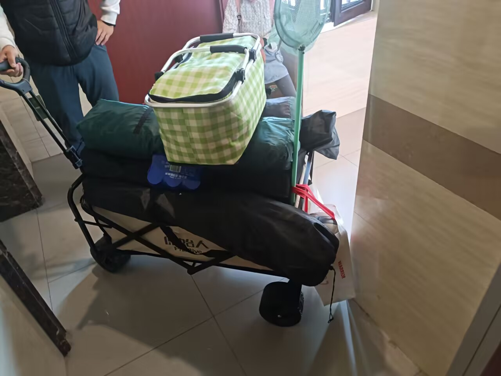
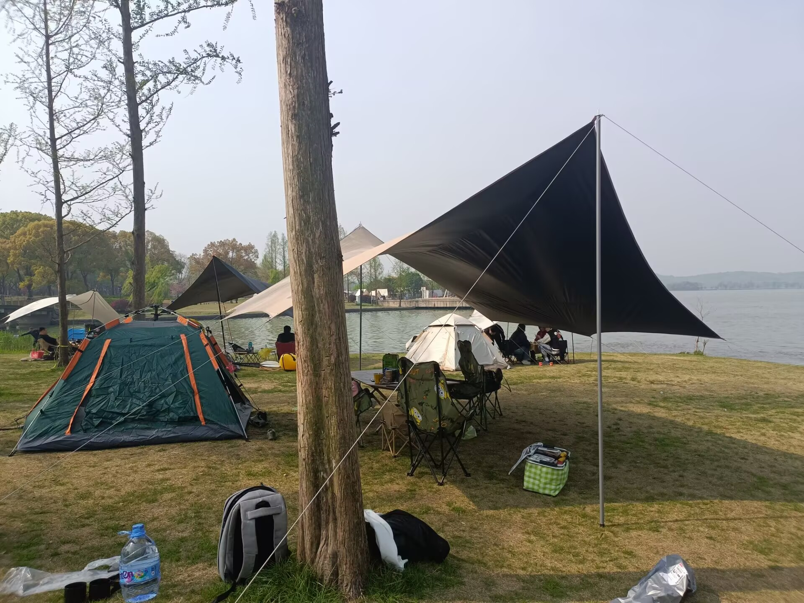
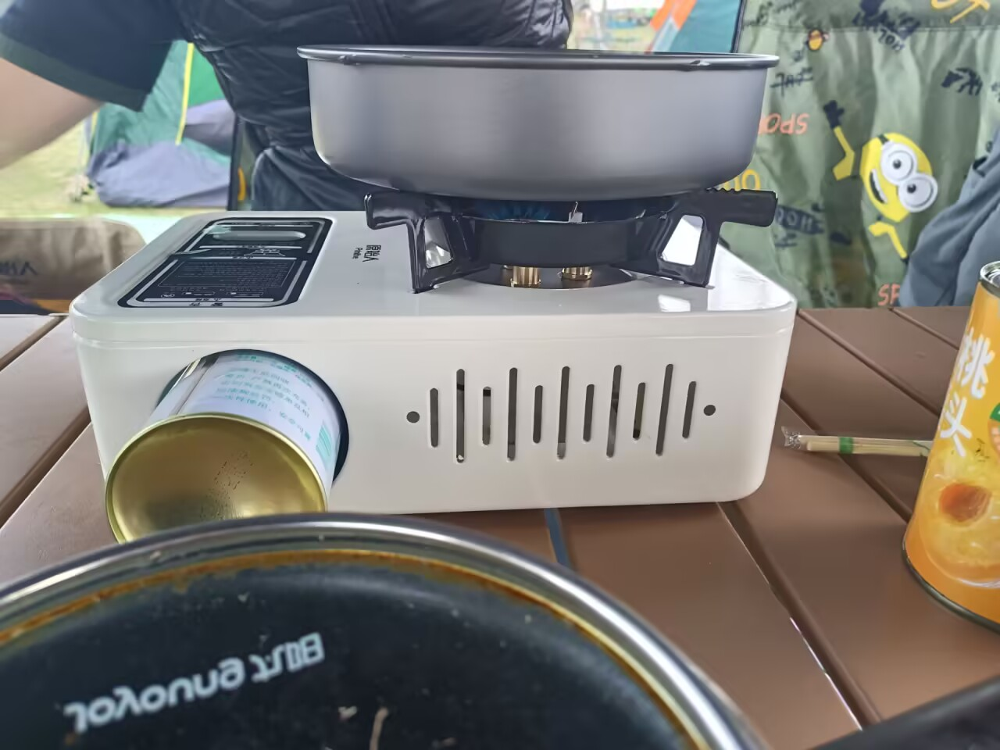

###                                           蠡湖露营

​       清明假期，我叔决定带我们去无锡蠡湖旁露营，他提前就买好了露营需要的各种东西，天幕，帐篷之类的，装了整整一车😊。

怕湖边的好位置被占了，我们早上7点便起床出发了，多亏了这个小车，不然人拿这些东西肯定要累死了。路途很近，20分钟的车程，而且天气很给面子，不冷不热，微风习习。到了蠡湖旁，发现原本空荡荡的湖边已经撑起了几个帐篷，我们来的不算晚，好位置还有很多，选了一块离湖边不远的地方便开始搭帐篷。

第一步是拆！然后是搭天幕，天幕是这里面最难弄的，一个人的话超级难，两三个人就简单不少了，不一会便搭好了天幕，然后是帐篷，放桌子，椅子.....
最后如下：

真不错，吹着湖风，吃着零食，然后我便思考起了最近要做的游戏。
我们程序上的进展其实很顺利，各个模块设计的都还不错，主要是剧情，我们缺少一个引人入胜的剧情，我其实想象力很差，在湖边静坐着两个多小时也没有什么有趣的想法，突然，我想到了太平天国，一场轰轰烈烈的农民运动，这种现实生活发生过的事情要是坐进游戏里面该多么有趣啊，于是我便将现有的玩法和太平天国为主题发给了AI，不一会我就想到了饮料VS吸管的剧情，剧情在我的博客专栏，搜索关键字“新游戏的剧情”即可查看，这里不再赘述，我相信这一定能够做成一个引人入胜的游戏！

到了下午，天气变的更好了，我叔打开了买来的天然气锅，感觉这种锅是真的好用，只要插上天然气罐子，然后点击开火就可以了，防风而且没有烟。我尝试培根，牛肉卷，乌鸡卷，对于煎肉，果然还是培根好吃，肉卷没有煮出来的好吃，主要是有着一股腥味，不放调料吃下去反胃。

之后我完成了游戏剧情的设计，怪物的设计，部分程序上的设计，爽！
快乐的时光总是短暂的，不经意间已是黄昏，望着岸上拍照的人们，湖上摇荡的小船，湖那边的高山田野，远处冉冉落下的太阳，真好，一直沉浸在代码世界中的我，这一刻也走出来了……风轻轻吹过，夹杂着湖水的清凉和泥土的芬芳，耳边传来远处人们的笑声和船桨划水的节奏，仿佛时间都慢了下来。
我站在湖边，深深吸了一口气，感觉那些堆积在心里的疲惫和焦虑，都被这眼前的宁静一点点吹散了。也许，生活不只是屏幕上的数字和逻辑，还有这样简单却触手可及的美。

