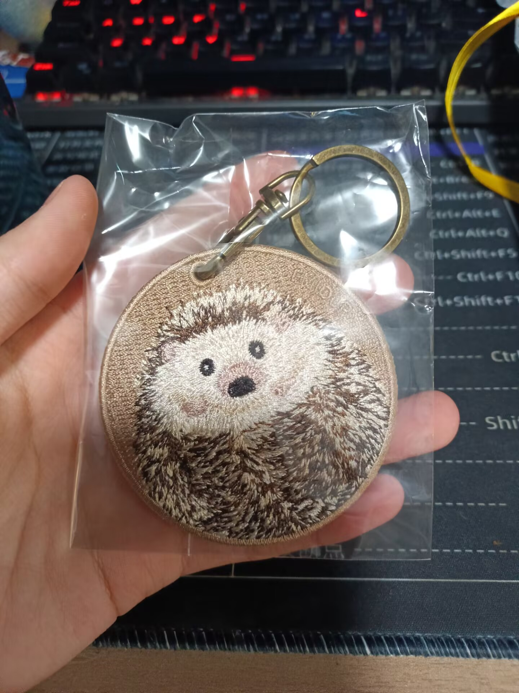
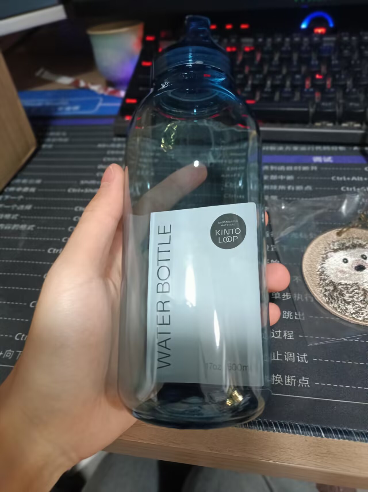

### 跨越山海的信物：写在与白井认识的第四年

今天，我收到了**白井朋子**（***しらいともこ***）送我的生日礼物。看着桌上那只憨态可掬的小刺猬钥匙扣、晶莹剔透的树脂水杯，以及那封厚厚的、尚未拆开便已觉沉甸甸的信封，我的心中泛起阵阵涟漪。😊

| 小刺猬钥匙扣 | 树脂水杯 | 还有最重要的信封❤ |
| :---: | :---: | :---: |
|  |  |  |

说起这段缘分，还得从高二那年说起。那时候我英语成绩不太理想，犹豫再三，最后决定“转行”学日语。既然学了，就想找个日本人聊聊天，看看真正的日本生活是什么样的。在姐姐的推荐下，我下载了 HelloTalk，就在那里遇到了想学中文的白井朋子。

**其实，学日语是我自己的选择，但遇见朋子，却让我的学习变得有趣多了。**

刚认识的时候，我日语水平一般，开口说话特别紧张。朋子脾气特别好，总是耐心地等我把话说完。这四年里，我们成了最好的“语伴”：她教我日语助词怎么用、帮我纠正发音，我也教她中文里的“把”字句，帮她练习四个声调。

我们就这样互相“改作业”，互相鼓励。在这种陪伴下，我的日语进步得飞快，最后高考日语考得非常不错！朋子也很厉害，她也顺利通过了 HSK（汉语水平考试）。看到对方在考试中都取得了理想的成绩，这种一起进步的感觉，真的特别棒！

|                        2022年12月7日                         |                        2022年12月28日                        |
| :----------------------------------------------------------: | :----------------------------------------------------------: |
|  |  |

一转眼，我已经从那个查单词发消息的高二学生，变成了大三的学生。虽然生活在变，但我们的联系从没断过。

今年她生日的时候，我选了好久，送了她一个皮包。**当看到照片里她背着包包笑得那么开心时，我觉得所有的挑选都是值得的。那是我们友情的见证，也是我想送去的一份陪伴。**

而今天收到的回礼，更是让我心头一暖。那个小刺猬钥匙扣，憨憨的样子特别像肉嘟嘟的Code；树脂水杯透亮透亮的，就像我们这四年简简单单、干干净净的友情。

最珍贵的还是那封手写信。现在大家都习惯发微信，这种一笔一画写出来的文字反而更有分量。我发现她的汉字写得越来越漂亮了，每一笔里都能感受到她的用心。

四年时间，我们从屏幕两端的陌生人变成了无话不谈的好朋友。日语带我看到了更大的世界，而遇见朋子，是我这段旅程中最幸运的事。

关于我和朋子之间更多有趣的小故事，以后我再慢慢写给大家听。

朋子，谢谢你的礼物，也谢谢你陪我走过的这四年。我们要一直一起努力，一起进步呀！

