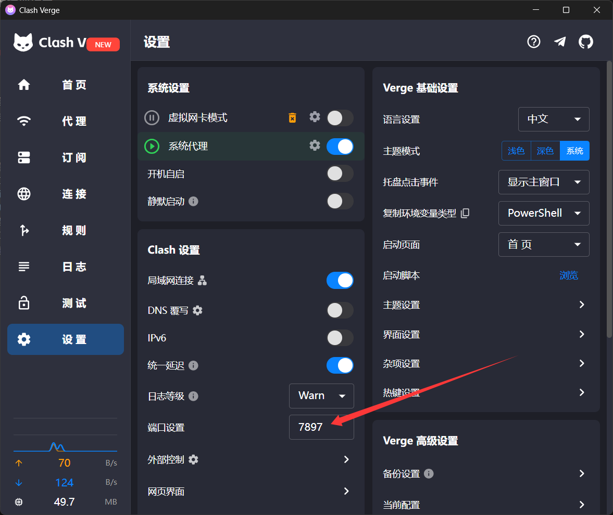
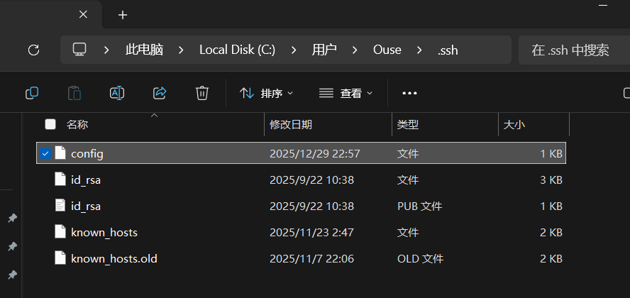

### Git配置代理指南

#### 前言

有时候github明明可以正常访问，但是git clone url非常慢，今天这里一篇指南来解决。
原理解析，一般大家使用的是系统代理，系统代理只是设置一个规则，不是所有的应用都会使用它的规则，所以就需要单独设置，比如git,docker。
Tip:如果您使用的了Tun模式，就不需要考虑上面的问题，因为这个是构造一个虚拟网卡，你的所有浏览都会走这个网卡。因此你可以尝试使用Tun模式，如果不行可以再看以下指南。

#### 准备

1. 首先安装好git
2. 电脑已有代理等相关....

#### 开始

1. 首先您要知道当前要git的仓库是什么类型，比如是ssh还是http呢?
   如果您还未clone仓库，只需要看您clone的链接是以下哪种类型
   git@github.com:0use-TE/OuseBlog.git
   https://github.com/0use-TE/OuseBlog.git
   第一种是ssh，第二种是http
   如果是已经clone好的仓库，只需要执行git remote -v查看
2. 查看本地代理的端口号，一般是7890或者7897

   
3. 知道了以上信息，就可以根据您的需求选择设置ssh代理，还是http

   1. 配置ssh
      打开User/.ssh/目录下的  config文件，如果没用请创建一个
      
      在下面添加以下代码

      ```js
      Host github.com
          HostName github.com
          User git
          ProxyCommand connect -S 127.0.0.1:7897 %h %p
      ```

      这里的意思是：使用ProxyCommand这个小工具把ssh的流量交给7897端口
      这里的参数-S代理的是Socket5，如果您的代理不支持请改为-H，这代表的是Http，后面的%h,%p是占位符(不用关心)

      然后再次使用git测试
   2. 配置Http
      在配置前，我们可以先使用git指令查看现在的代理规则，如下

      ```bash
      git config --global https.proxy
      git config --global http.proxy
      ```

      预期的输出应该是http://127.0.0.1:7897和http://127.0.0.1:7897（注意，这里均为http，因为这是本机代理服务，不需要加密!）
      如果您配置错误，请输入以下指令，先取消配置

      ```bash
      git config --global --unset http.proxy
      git config --global --unset https.proxy
      ```

      之后我们进行配置

      ```bash
      git config --global http.proxy http://127.0.0.1:7897
      git config --global https.proxy http://127.0.0.1:7897
      ```

      执行后可以使用上面的指令查看是否配置成功
      之后便测试git clone
4. 如果以上还是不行，您可以使用抓包工具，查看流量是否走了您的代理端口

#### 结语

通过此篇文章，希望您可以再也不受到光明网的限制，访问Github!
